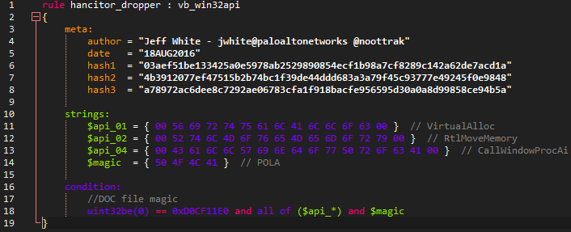

# udl-yara
Notepad++ User Defined Language for Yara rules

## Screenshot:

## Pre-requisites:
> In Notepad++, click Settings, then Style Configurator.
> In the right half of the pane for "Global Styles: Global override" click the color box next to background color to choose your color.
> Check the box that says "enable global background color".

## Installation:
> You can either import the xml through Language -> User Defined Language... -> Import or copy the contents of udl-yara.xml into one of the following main xmls:
> userDefineLang.xml or langs.xml